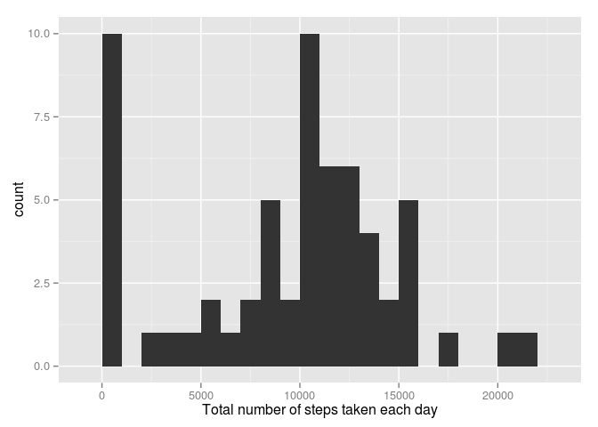
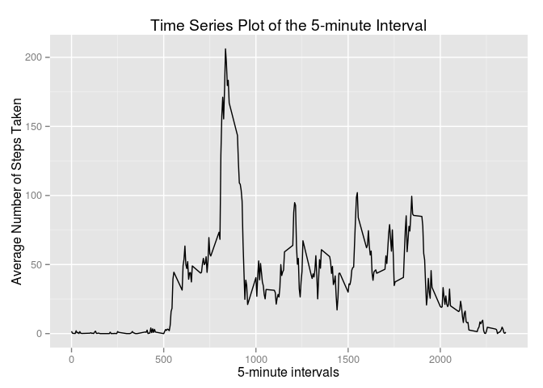
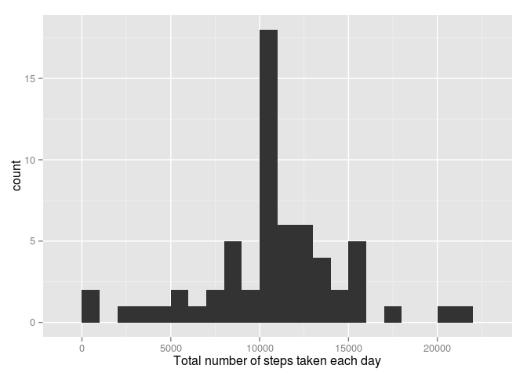
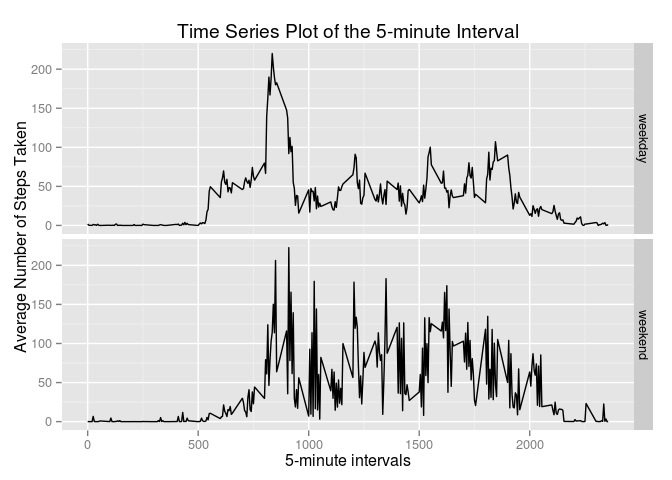

# Reproducible Research: Peer Assessment 1


## Loading and preprocessing the data
Unzipping and reading the activity csv file into a data table format

```r
library(data.table)
data <- read.csv(unz("activity.zip", "activity.csv"))
data <- data.table(data,keep.rownames=FALSE)
```

## What is mean total number of steps taken per day?
Making a histogram of the total number of steps taken each day.
And calculating the mean and median total number of steps taken per day

```r
library(plyr)
hist_data <- ddply(data, .(date), summarize, total_steps = sum(steps, na.rm = TRUE))
library(ggplot2)
qplot(total_steps,data=hist_data,binwidth=1000,xlab="Total number of steps taken each day")
```

 

```r
mean <- mean(hist_data$total_steps)
median <- median(hist_data$total_steps)
```
- The mean of total steps taken each day is **9354.2295082**. 
- The Median of total steps taken each day is **10395**.

## What is the average daily activity pattern?
Making a time series plot (i.e. type = "l") of the 5-minute interval (x-axis) and the average number of steps taken, averaged across all days (y-axis)
To find the most active time interval is by finding the interval with the max number of steps

```r
library(plyr)
avg_data <- ddply(data, .(interval), summarize, avg_steps = mean(steps, na.rm = TRUE))
ggplot(data=avg_data, aes(x=interval, y=avg_steps)) + 
  geom_line() + 
  labs(title = "Time Series Plot of the 5-minute Interval", x = "5-minute intervals", y = "Average Number of Steps Taken")
```

 

```r
i <- avg_data[which.max(avg_data$avg_steps),]
x<- i$interval
```
- The interval with maximum average steps is **835**.

## Imputing missing values
There are many days/intervals where there are missing values in the data set represented as NA.
The presence of missing days may introduce bias into calculation of summaries of the data like mean, median etc.

```r
NA_values <- is.na(data$steps)
Total_NA <- sum(NA_values==TRUE)
```

- The number of NA values in the original data set is **2304**

To create a new data set having no NA values, we will fill in the missing values with mean value for that 5-minute interval.

```r
new_data <- mutate(data, steps = ifelse(!is.na(steps), steps, avg_data$avg_steps))
hist_data <- ddply(new_data, .(date), summarize, total_steps = sum(steps, na.rm = TRUE))
qplot(total_steps,data=hist_data,binwidth=1000,xlab="Total number of steps taken each day")
```

 

```r
new_mean <- mean(hist_data$total_steps)
new_median <- median(hist_data$total_steps)
```

Mean and median values are **1.0766189\times 10^{4}** and **1.0766189\times 10^{4}** respectively. As we can see these are higher after imputing missing data. The reason is that in the original data, there are some days with steps values NA for any interval. The total number of steps taken in such days are set to 0s by default. However, after replacing missing steps values with the mean steps of associated interval value, these 0 values are removed from the histogram of total number of steps taken each day.

## Are there differences in activity patterns between weekdays and weekends?

```r
new_data$date <- as.Date(new_data$date)
new_data <- mutate(new_data,  Day = weekdays(new_data$date))
new_data <- mutate(new_data,  Day = ifelse(Day== c("Saturday","Sunday"), "weekend", "weekday"))
avg_data <- ddply(new_data, .(interval,Day), summarize, avg_steps = mean(steps, na.rm = TRUE))
ggplot(avg_data, aes(interval, avg_steps)) + geom_line() + facet_grid(Day ~ .) +
     labs(title = "Time Series Plot of the 5-minute Interval", x = "5-minute intervals", y = "Average Number of Steps Taken")
```

 
